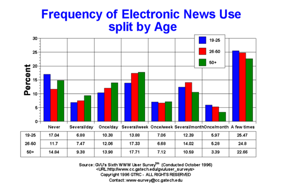

# Original Visualization

This is the visualization that I chose which shows Frequency of Electronic News usage divided by categories and age. It can also be accesed using this source 

# Choice

I selected this visualization because I am coming from a quantitative background and I am interested in topics related to statistics comparisons, trends, or projections. I think it is very useful to summarize results using percentages because everyone can understand easily when something is good or not. Also, it was a simple graph but I though that even if it was simple, the way it was designed was not simple! I wanted to simplify the graph. The second reason is that I could replicate the data in a csv file and use the table to redesign my graph. At the beginning, I was struggling finding an interesting graph with public data available.

# Process

When I first saw the graph, I knew there were many things that could be improved. I got the underlying idea, but it took me more time than what was required to show the message that the author was trying to make which was very simple.
When I did the effective analysis, I had a better understanding of which features were the ones that needed more improvements.
Perceptibility was not so good in this visualization.
Completeness was lacking information about historical data but we did not have the data for different years so I could not work on improving that
Aesthetics was one of the aspects that needed more attention to make the graph appealing.
With that in mind, I focus on improving these three areas. I created my version of the graph after thinking of the audience and the message to convey. Changing colors, size, layout, number of thing to show, gridlines. Once I was happy with my first sketch, I showed it to my peers.

With the changes I made to the original bar graph they understood quicky the idea of the graph showing the frequency of electronic news use divided by age ranges. Regarding the audience, they agreed on owners of online newspapers as the main audience Nobody had problem in getting the message. However, I created two more versions after that because they gave me some suggestions to avoid making the graph still a bit confusing. The new changes were,

•	Changing the axis using age for x axis and categories for colors to show better the data

•	Adding labels with the numbers for the bars

•	Changing title name to a question representing what the data wants to answer.

I found very interesting the fact that changing the axis could simplify the understanding of the idea. I did not have that idea when I was first looking at the graph. Also, the title using a question I think it is powerful because you associate the answer to the question directly in the data you are looking at.

# Final Visualization

The final visualization I created in Tableau shows the answer to the question in the title. Who consumes more electronic news? It is divided by age groups and it shows three categories which are: once a day, multiple times a day and multiple times a week. We can see the percentage of population under each category and age range. It is more clear and visually appealing. I showed again the final visualization to my peers and they were happy with the changes I implemented in the final graph.

<iframe
src="https://public.tableau.com/views/A3_16137944666540/Dashboard1?:showVizHome=no&:embed=true" width="90%" height="500" seamless frameborder="0" scrolling="no"></iframe>

