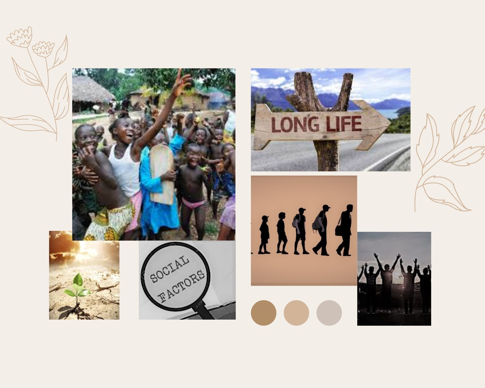

# Changes from Part 1

After submitting part 1 and reviewing the data in detail, I decided to make a small change in the message to convey. I am going to base my analysis in the comparison of Finland (high life expectancy) and Sierra Leone (low life expectancy) and the idea is to show factors that made Finland a country with people living longer. Some of them are external and related to governement strategies and policies but some factors are internal and are social. All of them are high in Finland and low in Sierra Leone. My message will be to try to focus on the internal factors that are the ones we have control over such as Family time, Generosity, Freedom. These factors are related to happiness and studies show that happiness contributes to living longer. Thus, in other words, we can contribute to living longer.

# Moodboard

I created this moodboard using Canva which shows a sense of hope and happiness given that life expectancy could improve by focusing on the social factors. I thought it was a good idea to give a more visual focus on my message. I incorporated some ideas in the wireframes and storyboard.

# Wireframes in Shorthand

In the first part of the final project, I created some sketches to start building my story. In this part, I went far and I tried to build my story using Shorthand to get familiar with the tool. However, the main reason why I decided to use Shorthand was that I wanted to create an advance draft of what the final project was going to look like. By doing that, I was able to ask for feedback to some people and get a more accurate idea of improvements when I documented the findings. 

Below is the link to the wireframes and storyboard in Shorthand

[Go to presentation](https://preview.shorthand.com/wekqSHCGQIgCcBF9)

# User Research Protocol

**Target Audience**

Population of undeveloped countries like Sierra Leone in Africa with poor distribution of resources, little education, and low access to health services. Particularly citizens between 15-40 years old because life expectancy in these countries is too low (average of around 40 years old). Therefore, to generate an impact we will need to action before that age.

**Motivation**

Coming from an actuarial background, I was interested in the longevity topic and I have a passion to help people and try to create a better future for the next generation. When I found this topic, I thought it was going to be a great opportunity to combine both aspects. Sometimes we tend to believe that the drivers behind the current problems are external and we do not realize that we can contribute to an extend to make the change possible. I want to raise awareness and give hope with my findings.

**Approach to identifying individuals**

The objective in my approach will be to gather people from different backgrounds so that we do not bias the results. For example, one participant is a psychology student. Why? Because my topic is related to a change in behaviour and the relationship between social factors and longevity. She will be interested in the topic and she could give me constructive feedback about ideas to implement and show the findings. Also, I asked the questions to a low class person so that he can give more feedback about how to approach my audience in conveying the general message. My audience is people with low resources so he may be more touched about the story and help me with the emotional and motivational goal. I prepared a script with questions and the approach will be to show them the presentation and then think of answers to my questions. The questions asked are related to understanding of the story, previous knowledge, consistency, visualization critique, emotional aspects, motivation to contribute to a change and finally, feedback for improvement.

# Research Goals

The main goals that I had before starting the interviews were,

- Understanding: I wanted to know if the participants got the key message of the story and understood who was the target audience I was planning to get attention from. This is esential and if it is not clear, it means I need to adjust the story.

- Previous Knowledge: As this topic is not so well-known, I wanted to see if people had an idea about my findings before reading the story I showed them. This also helps to see if people who are not familiar with the topic can follow the flow of the story

- Consistency: A good story is easy to follow, the visualizations supports the story instead of creating more confusion. If somethhing is misleading, it is better to identify it now so that I can improve it for the final project.

- Design: The aim here is to apply concepts learned in the course so far to make it simple but meaningful. Because of that, I want to ask for feedback in elements like colors, size, layout, titles, etc.

- Emotions: I want to reach my audience not only with the technical details and numbers but also with feelings. My topic is sad for poor countries but I am trying to give hope. I would like to know the feeling process while the read the story.

- Motivation: As I want to give a motivational message, I want to understand how well is the message transmitted, whether people feel like inspired to focus more on improving social factors or not. 

- Area of Improvements: After all the previous analysis, the idea is too see general comments that people think can enhance the story. Opinions and changes to implement into the presentation to be more persuasive.

# Interview Script 

With the goals in mind, I focused on preparing the interview script that we can find below,

Thank you for your time in helping me with your feedback.

I am doing a project for a course at university called "Telling Stories With Data". I am doing a final project and I chose to talk about Life expectancy in poor countries. This is a draft of what the final project is going to look like. I appreciate if you can help me reading the presentation and answering the following questions to improve the final version. I would like to evaluate these aspects in order to prepare a more persuasive presentation and reach my target audience.

- Do you understand the message of the story? Do you know who the target audience is?
- Did you know about the relationship between social factors and life expectancy?
- Do the visualizations support the idea? Did you find anything confusing? 
- Do the colors/design/layout/size/labels/etc are appropriate? Are the visualization eye-catching? 
- How did you feel after reading? 
- Were you inspired to think that you can make a change possible?
- What worked well and bad? Is there anything that you would change? 

Thank you so much for your time and answers.

# Findings

The first participant answered the following,

| Objective     | Male - 26 years old - Social Sciences (Economist)    |
| ------------- | ------------- |
| Understanding  | Yes, the message that we can make a difference to change for better is clear. I believe the target audience is people from poor countries, people interested in economics and the general public as well.  |
| Previous knowledge  | Yes, but I had not thought about it with the level of detail on this article. I've just heard about a possible relationship on some talks or articles  |
| Consistency  | Yes absolutely, the visualizations are very clear and do support the idea. Nothing confusing from my end |
| Design  | Yes, the design is adequate, the visualizations are eye-catching. The colors are appropiate, the layout and the labels are correct  |
| Emotions  | This article made me think about how sometimes in life we prioritize some things that we think might makes us happier but then actually don't as much as we thought. And I realised that other things as these social factors are more important than what we think. |
| Motivation  | Yes indeed, as the article says even though sometimes we might feel small in this huge world, I believe that each person can make a difference and change the world for the better. I felt inspired after reading Ghandi's quote. Good ending.  |
| Improvement | I really liked the inspiring message of the article and the perspective of the internal factors. The transition of maps is also nice. As a recommendation, I would try to use images in higher resolution in order to have a more professional look as a whole. But overall, the presentation and the links to the studies look good. It shows that you hvae done research about the topic.  |

The second participant answered the following,

| Objective     | Question    | Feedback 2    |
| ------------- | ----------- | ------------- |
| Understanding  | Do you understand the message of the story? Do you know who the target audience is?  | Contenido de la celda  |
| Previous knowledge  | Did you know about the relationship between social factors and life expectancy?  | Contenido de la celda  |
| Consistency  | Do the visualizations support the idea? Did you find anything confusing?  | Contenido de la celda  |
| Design  | Do the colors/design/layout/size/labels/etc are appropriate? Are the visualization eye-catching?  | Contenido de la celda  |
| Emotions  | How did you feel after reading?   | Contenido de la celda  |
| Motivation  | Were you inspired to think that you can make a change possible?  | Contenido de la celda  |
| Improvement | What worked well and bad? Is there anything that you would change?  | Contenido de la celda  |

The third participant answered the following,

| Objective     | Question    | Feedback 3    |
| ------------- | ----------- | ------------- |
| Understanding  | Do you understand the message of the story? Do you know who the target audience is?  | Contenido de la celda  |
| Previous knowledge  | Did you know about the relationship between social factors and life expectancy?  | Contenido de la celda  |
| Consistency  | Do the visualizations support the idea? Did you find anything confusing?  | Contenido de la celda  |
| Design  | Do the colors/design/layout/size/labels/etc are appropriate? Are the visualization eye-catching?  | Contenido de la celda  |
| Emotions  | How did you feel after reading?   | Contenido de la celda  |
| Motivation  | Were you inspired to think that you can make a change possible?  | Contenido de la celda  |
| Improvement | What worked well and bad? Is there anything that you would change?  | Contenido de la celda  |

# Plan To Implement New Insights

After talking to some people and getting their feedback, I analyzed the answers and I thought of implementing these changes in the final version of the project so that my story results more effective.

-
-
-
-

