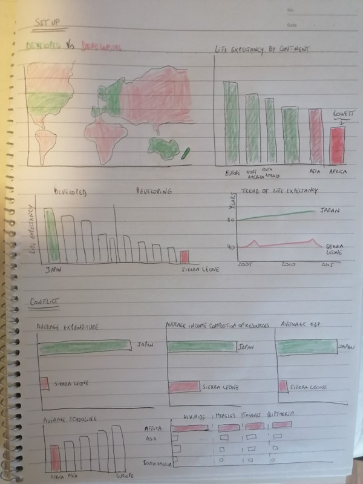
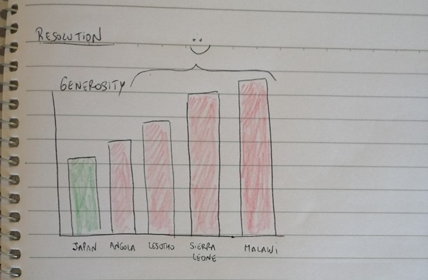

Navigate through the pages in case you want to see the content of different parts,

[Home Directory](README.md)

[Go to Final Project - Part 1](final_project_TatianaMargulies.md)

[Go to Final Project - Part 2](final_project_2_TatianaMargulies.md)

[Final Presentation in Shorthand](https://carnegiemellon.shorthandstories.com/can-we-contribute-to-living-longer--/index.html)

# Summary of Part 1

# Outline

The idea of the project is to give hope to people with the message that generosity in poor countries like some in Africa, can be a key issue to increase longevity. The idea is to convince them that even though there are things that as individuals we cannot control because they are external and more related to government strategies, policies, development of the country, etc everyone can make a little contribution to solve this problem by adopting generous practices in our daily lives.

Project structure

-Setup: Developed countries have higher life expectancy than developing countries.

-Conflict: The reasons driving life expectancy appear to be external, related to government policies/strategies

-Resolution: Generosity could make us live longer and as it is internal, we can adopt it.

# Initial Sketches

These are the sketches that give an idea of the setup, the conflict and the resolution,

# Data

The data to be used in the project consist of three different datasets,

1) Life expectancy: This is the main dataset which includes information about all the countries with different time periods from 2005 to 2015. It shows the life expectancy values for each country, some diseases such as HIV/Hepathitis/ Measles, infant deaths, developed countries, public expenditure on health, schooling, etc.

Source: [World Health Organization (WHO)](https://www.kaggle.com/kumarajarshi/life-expectancy-who)

2) Mapping of continents: This dataset has the mapping of countries and continents to provide some information at a higher level. It will be used at the beginning to show a summary of the situation by continent instead of showing all the countries. 

Source: [United Nations Statistics Division](https://statisticstimes.com/geography/countries-by-continents.php)

3) Happiness world index: This dataset has a list of countries with the happiness score for each country as well as the rank. It also shows how factors such as family, trust in government, generosity, contribute to the happiness score. It is going to be merged with the life expectancy dataset.
 
Source: [World Happiness Report](https://www.kaggle.com/unsdsn/world-happiness)

# Method and Medium

The project is going to be developed using Shorthand as a tool to create the presentation and the tool to generate the visualizations will be mainly Tableau. 
The development of the project will start by contrasting in a map the countries that are developed and developing. Once we have an idea about geographical regions we will start summarizing the data by continents to go from general to more specific information. The idea will be to compare variables like life expectancy, GDP, public spenditure, diseases. Then, we can focus the attention on the countries with highest life expectancy and lowest life expectancy to compare them and try to identify the reasons behind the values. Finally, the idea will be to show that living longer depends on the factors analyzed but something important that nobody considered is that social factors like generosity are higher in the countries which are less developed. And the poweful thing here is that we have control about that, so living longer could start with us.

# Summary of Part 2

# Changes from Part 1

After submitting part 1 and reviewing the data in detail, I decided to make a small change in the message to convey. I based my analysis in the comparison of Finland (high life expectancy) and Sierra Leone (low life expectancy) and the idea was to show factors that made Finland a country with people living longer. Some of them are external and related to governement strategies and policies but some factors are internal and are social. All of them are high in Finland and low in Sierra Leone. My message will be to try to focus on the internal factors that are the ones we have control over such as Family time, Generosity, Freedom. These factors are related to happiness and studies show that happiness contributes to living longer. Thus, in other words, we can contribute to living longer.

# Wireframes in Shorthand

In the first part of the final project, I created some sketches to start building my story. In this part, I went far and I tried to build my story using Shorthand to get familiar with the tool. 

Below is the link to the wireframes and storyboard in Shorthand

[Go to presentation](https://preview.shorthand.com/wekqSHCGQIgCcBF9)

# User Research Protocol

**Target Audience**

Population of developing countries like Sierra Leone in Africa with poor distribution of resources, little education, and low access to health services. Particularly citizens between 15-40 years old because life expectancy in these countries is too low (average of around 40 years old). Therefore, to generate an impact we will need to action before that age.

**Approach to identifying individuals**

The objective in my approach was to gather people from different backgrounds so that we do not bias the results. For example, one participant is a psychology student. Why? Because my topic is related to a change in behaviour and the relationship between social factors and longevity. She was be interested in the topic and she could give me constructive feedback about ideas to implement and show the findings. Also, I asked the questions to a refugee that came to Australia so that he can give more feedback about how to approach my audience in conveying the general message. My audience is people with low resources so he may be more touched about the story and help me with the emotional and motivational goal. I will focus more in people with social sciences background.

# Research Goals

The main goals that I had before starting the interviews were,

- Understanding:

- Previous Knowledge

- Consistency

- Design

- Emotions

- Motivation

- Area of Improvements

# Interview Script 

With the goals in mind, I focused on preparing the interview script that we can find below,

Thank you for your time in helping me with your feedback.

I am doing a project for a course at university called "Telling Stories With Data". I am doing a final project and I chose to talk about Life expectancy in poor countries. This is a draft of what the final project is going to look like. I appreciate if you can help me reading the presentation and answering the following questions to improve the final version. I would like to evaluate these aspects in order to prepare a more persuasive presentation and reach my target audience.

- Do you understand the message of the story? What is it? Do you know who the target audience is?
- Did you know about the relationship between social factors and life expectancy?
- Do the visualizations support the idea? Did you find anything confusing? 
- Are the colors/design/layout/size/labels/etc appropriate? Are the visualization eye-catching? 
- How did you feel after reading? 
- Were you inspired to think that you can make a change possible?
- What worked well and bad? Is there anything that you would change? 

Thank you so much for your time and answers.

# Findings

After the critique exercise in class, I also got some feedback:

- Change color in negative external factor for Finland (I forget to put blue as the graph above)
- The second map color has orange and it can be confused with the orange in the previous map
- Use of infographics could be useful for the factors 

# Plan to implement new insights

Summarizing all the comments that I received, this is the conclusion:

**Worked well**:

- Understanding of audience and key message
- Design and transitions
- Research about the topic
- Supporting visualizations
- Inspiration feeling

**Worked bad**:

- Internal factors part too short
- Terminologies not explained
- Low resolution in some images
- Some labels missing for diseases in negative external factors
- Title add developed countries too

**What I would change**:

- Mention ways to contribute implementing social factors
- Extending internal factors part
- Rephrase some paragraphs

I considered what worked well, bad, what I would change and the feedback from my classmates to implement these changes in the final version of the project so that my story results more effective.

# Part 3

# Changes in the Story

Part 1 of the project was useful in the way that it helped to sketch the idea of the project. I started thinking about the message, how to present the data, which graphs were more effective and to have an idea of the audience.
In part 2, I could narrow down the analysis and focus on a more specific audience. I improved the visualizations using tools and created a draft of the presentation to show to different users.
With that in mind, I received comments and feedback that made me realised that still there was a lot to improve and I got ideas to implement in the final story. It also helped me to notice that I needed to extend the last part of the story to reach my audience. My audience is people from developing countries with low resources and, I was not giving so much attention to ways to improve life expectancy as I gave to the introduction and the problem. This was a key finding in part 2. 

The fact of doing the critique exercise in class was valuable. First, I noticed that different people have different perspectives and ways of looking at the things. With the interviews in part 2 I got a lot of value with changes I have not thought about before. But also, it is important to know that sometimes different backgrounds and personal situations make people focus on different aspects. The critique I got from class, was more related to changes in the visualization to make them more effective. This was also result of the learning in the course about how to be more persuasive, not to overload graphs, correct use of colors and design. For example, they suggested removing axis if I did not want to highlight the numbers but the size. The findings I got from the interviews, were more realted to message, structure of the story and content itself. My reflection on this is that it is useful to experiment both methods before jumping into the final project because they complement each other and you can maximize the value listening to other perspectives.

Because of the previous two parts of the project, I arrived to the third part of it with a clearer picture of what changes I needed to implement. 

I decided to make the following modifications in my story,

1) I extended the internal factors part because it represents my main message and it was short in comparison to the introduction 

2) I explained terminologies that I assumed people already knew like GDP (Gross Domestic Product)

3) I changed some images to improve the resolution

4) I added infographics to better explain the comparison between positive and negative external factors. The bar charts were a bit confusing. The comments from part 2 correction also suggested a change in the way to display the data.

5) I changed the title and added developed countries too because my comparison is between developing and developed countries

6) I rephrased almost all the paragraphs of the story to use a more effective language for the purpose of the presentation. The first version was a draft.

7) I mentioned some ways to contribute to living longer. The call to action was there but now I also gave some ways to make it possible apart from the fact of conveying the message.

8) I added references at the end of the presentation with the datasets used and the story links.

9) I removed axis in the internal factors graphs because it was creating confusing in the reader as there were more than one measure analysed and different scales. The idea with these visualizations is to show high or low not the exact value, so it was better to look at the bar itself.

# Link to Story

To access the final presentation in Shorthand, use the following link:

[Go to presentation](https://carnegiemellon.shorthandstories.com/can-we-contribute-to-living-longer--/index.html)

# References

**Datasets**

- [https://www.kaggle.com/kumarajarshi/life-expectancy-who](https://www.kaggle.com/kumarajarshi/life-expectancy-who)

- [https://statisticstimes.com/geography/countries-by-continents.php](https://statisticstimes.com/geography/countries-by-continents.php)

- [https://www.kaggle.com/unsdsn/world-happiness](https://www.kaggle.com/unsdsn/world-happiness)

**Story**

- [https://www.valrhona-chocolate.com/commitment](https://www.valrhona-chocolate.com/commitment)

- [https://www.everydayhealth.com/healthy-living/cdc-reports-drop-us-life-expectancy/](https://www.everydayhealth.com/healthy-living/cdc-reports-drop-us-life-expectancy/)

- [https://www.dreamstime.com/illustration/heartbeat.html](https://www.dreamstime.com/illustration/heartbeat.html)

- [http://www.nickmilton.com/2014/02/your-cko-internal-or-external.html](http://www.nickmilton.com/2014/02/your-cko-internal-or-external.html)

- [https://theconversation.com/happiness-may-be-a-choice-except-that-its-constrained-by-vested-economic-interests-118435](https://theconversation.com/happiness-may-be-a-choice-except-that-its-constrained-by-vested-economic-interests-118435)

- [https://www.rachelbeohm.com/make-it-easy-for-others-to-give-you-what-you-want/](https://www.rachelbeohm.com/make-it-easy-for-others-to-give-you-what-you-want/)

- [https://www.istockphoto.com/search/2/image?phrase=freedom](https://www.istockphoto.com/search/2/image?phrase=freedom)

- [https://www.hsph.harvard.edu/news/hsph-in-the-news/active-social-life-longevity/](https://www.hsph.harvard.edu/news/hsph-in-the-news/active-social-life-longevity/)

- [https://greatergood.berkeley.edu/article/item/how_your_social_life_might_help_you_life_longer](https://greatergood.berkeley.edu/article/item/how_your_social_life_might_help_you_life_longer)

- [https://medium.com/@LibyanRunner/be-the-change-you-want-to-see-in-the-world-66ca95186c99](https://medium.com/@LibyanRunner/be-the-change-you-want-to-see-in-the-world-66ca95186c99)

- [https://topyaps.com/top-10-ways-to-contribute-to-society/](https://topyaps.com/top-10-ways-to-contribute-to-society/)
